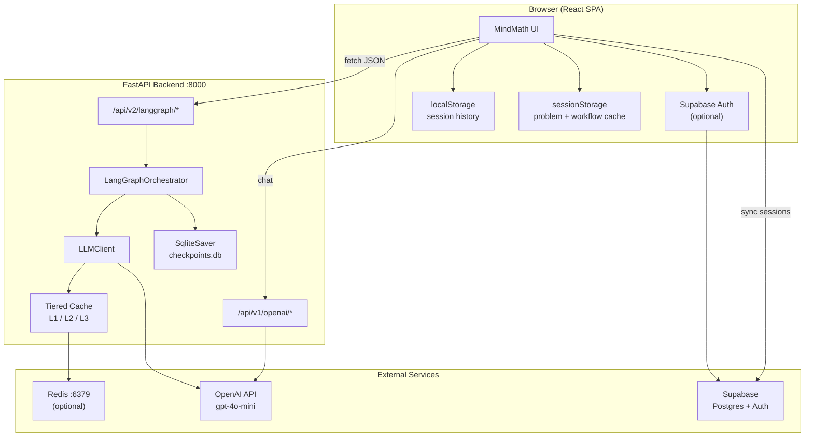
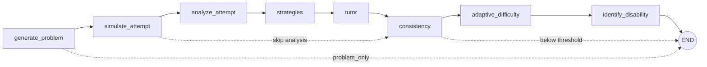
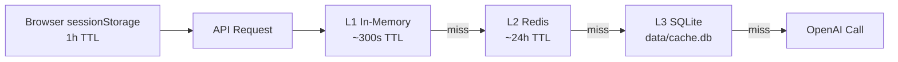
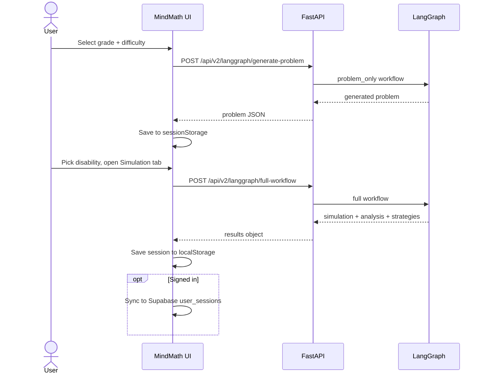

# MindMath

**MindMath** is an LLM-powered learning disability simulation platform for math education. Educators and researchers use it to generate grade-appropriate math problems, simulate how students with specific learning disabilities might approach those problems, and explore teaching strategies, tutor interactions, and consistency checks powered by a LangGraph workflow.

The app is built for exploration and professional development, not clinical diagnosis. The disability screening tool is a guided educational exercise with clear disclaimers.

---

## Table of Contents

- [What It Does](#what-it-does)
- [Who It Is For](#who-it-is-for)
- [System Architecture](#system-architecture)
- [LangGraph Workflow](#langgraph-workflow)
- [Caching](#caching)
- [User Flows](#user-flows)
- [Tech Stack](#tech-stack)
- [Project Structure](#project-structure)
- [Getting Started](#getting-started)
- [Environment Variables](#environment-variables)
- [API Reference](#api-reference)
- [Testing](#testing)
- [Security and Privacy](#security-and-privacy)
- [Deployment](#deployment)
- [Contributing](#contributing)

---

## What It Does

MindMath combines a React frontend with a FastAPI backend that orchestrates OpenAI models through LangGraph. A typical session looks like this:

1. An educator selects a grade level and difficulty, then generates a math problem.
2. They pick one of seven supported disabilities and run a simulation.
3. The system produces a simulated student attempt, thought-process analysis, teaching strategies, and a tutor conversation.
4. A consistency validator checks whether the simulated answer, steps, and disability profile align.
5. Optional tools include adaptive difficulty recommendations, a guided disability screener, an interactive whiteboard, and a floating AI tutor chat.

### Supported Disabilities

| ID | Disability |
|----|------------|
| 1 | Dyslexia |
| 2 | Dysgraphia |
| 3 | Dyscalculia |
| 4 | Attention Deficit Hyperactivity Disorder |
| 5 | Auditory Processing Disorder |
| 6 | Non Verbal Learning Disorder |
| 7 | Language Processing Disorder |

---

## Who It Is For

| Audience | Use case |
|----------|----------|
| Educators | Understand how a disability might affect math problem solving |
| Researchers | Study LLM simulation quality and consistency in educational contexts |
| Developers | Extend the LangGraph pipeline, add disabilities, or integrate new models |

The platform works without signing in. Optional Supabase authentication unlocks cloud session history.

---

## System Architecture



### Request path

The frontend calls the backend directly. There is no API gateway. The base URL is set by `REACT_APP_API_BASE` and defaults to `http://localhost:8000`. The backend does not validate Supabase tokens. CORS is restricted to origins listed in `ALLOWED_ORIGINS`.

---

## LangGraph Workflow

The core pipeline lives in `backend/LLM-Disability-Dashboard/app/services/orchestrator.py`. Each node is a prompt-driven step that reads and writes shared state.



### Workflow types

| Type | Stops after | Use case |
|------|-------------|----------|
| `full` | All nodes | Complete simulation pipeline |
| `problem_only` | Problem generation | Home page problem picker |
| `analysis_only` | Analysis nodes | Adaptive difficulty recommendations |
| `pre_tutor` | Strategies | Prewarm before tutor tab |
| `batch_simulate` | Attempt per disability | Multi-disability comparison |
| `disability_assessment` | Screening rounds | Guided screener flow |

Workflow checkpoints persist to `data/checkpoints.db` via LangGraph's `SqliteSaver`.

### Typical response shape

```json
{
  "results": {
    "generated_problem": {},
    "student_simulation": {},
    "thought_analysis": {},
    "strategies": {},
    "tutor_session": {},
    "consistency_validation": {},
    "adaptive_plan": {},
    "disability_analysis": {}
  },
  "metadata": {
    "cache_status": "hit",
    "consistency_score": 0.85
  }
}
```

---

## Caching

Repeated identical requests are expensive. MindMath caches at three server tiers plus a client layer.



| Tier | Location | Config |
|------|----------|--------|
| L1 | Process memory | `LANGGRAPH_CACHE_SIZE`, `CACHE_L1_TTL` |
| L2 | Redis | `REDIS_URL` + `docker compose up -d` |
| L3 | SQLite file | `CACHE_SQLITE_PATH` (default `data/cache.db`) |
| Client | `sessionStorage` | Built into `langgraphApi.js` |

Set `LANGGRAPH_CACHE_ENABLED=false` to bypass server caching during development.

---

## User Flows

### Problem generation and simulation



### Floating AI tutor chat

The chat widget is available on every page. It sends messages to `POST /api/v1/openai/chat` with optional problem context from the current session.

| Setting | Options |
|---------|---------|
| Mode | tutor, explain, practice, debug |
| Personality | helpful, challenging, friendly, expert |

### Frontend routes

| Path | Component | Purpose |
|------|-----------|---------|
| `/` | Problem | Generate math problems |
| `/disability/:id/details/description` | Description | Disability overview |
| `/disability/:id/details/attempt` | Attempt | Simulated student attempt |
| `/disability/:id/details/thought` | Thought | Thought-process analysis |
| `/disability/:id/details/strategies` | Strategies | Teaching strategies |
| `/disability/:id/details/tutor` | Tutor | Simulated tutor session |
| `/disability/:id/details/improvement` | Improvement | Before/after improvement analysis |
| `/disability-identifier` | DisabilityIdentifier | 3-round guided screening |
| `/adaptive-difficulty` | AdaptiveDifficulty | Difficulty recommendations from history |
| `/whiteboard` | InteractiveWhiteboard | Drawing canvas |
| `/my-history` | MyHistory | Cloud session history (auth required) |

---

## Tech Stack

### Frontend (`frontend/ap-ui/`)

| Layer | Technology |
|-------|------------|
| Framework | React 19, Create React App |
| Routing | React Router DOM v7 |
| Auth | Supabase Auth (`@supabase/supabase-js`) |
| Animation | Framer Motion |
| 3D visuals | Three.js, `@react-three/fiber` |
| Testing | Jest, React Testing Library |

### Backend (`backend/LLM-Disability-Dashboard/`)

| Layer | Technology |
|-------|------------|
| API | FastAPI, Uvicorn |
| Orchestration | LangGraph, LangChain |
| LLM | OpenAI (`gpt-4o-mini` default) |
| Rate limiting | slowapi (30 req/min on hot paths) |
| Caching | In-memory, Redis, SQLite |
| Persistence | SQLite checkpoints, Supabase (frontend) |
| Testing | pytest, httpx |

---

## Project Structure

```
AMS585/
├── docker-compose.yml              # Optional Redis for L2 cache
├── supabase/
│   └── schema.sql                  # user_sessions table + RLS policies
├── frontend/
│   └── ap-ui/
│       ├── src/
│       │   ├── Components/         # UI pages and widgets
│       │   ├── Context/            # WorkflowProvider
│       │   ├── Store/              # Auth, theme, disability data
│       │   ├── Utils/              # langgraphApi, session helpers
│       │   └── lib/                # Supabase client
│       └── public/                 # Static assets, logo
└── backend/
    └── LLM-Disability-Dashboard/
        ├── main.py                 # FastAPI entry point
        ├── app/
        │   ├── Routes/             # openai_routes, langgraph_routes
        │   └── services/           # orchestrator, cache, validators
        ├── data/                   # cache.db, checkpoints.db (gitignored)
        └── tests/                  # pytest suite
```

---

## Getting Started

### Prerequisites

- Node.js 16 or higher
- Python 3.9 or higher
- OpenAI API key (required for core features)
- Optional: Supabase project, Docker (for Redis)

### 1. Clone and enter the repo

```bash
git clone https://github.com/AtharvRaotole/LLM-Powered-Learning-Disability.git
cd LLM-Powered-Learning-Disability
```

### 2. Start the backend

```bash
cd backend/LLM-Disability-Dashboard
python -m venv venv
source venv/bin/activate        # Windows: venv\Scripts\activate
pip install -r requirements.txt
cp .env.example .env            # Add your OPENAI_API_KEY
python main.py
```

The API starts at `http://localhost:8000`. Interactive docs are at `http://localhost:8000/docs`.

### 3. Start the frontend

```bash
cd frontend/ap-ui
npm install
cp .env.example .env            # Optional: Supabase + API base URL
npm start
```

The app opens at `http://localhost:3000`.

### 4. Optional: Redis cache

```bash
# From the repo root
docker compose up -d
```

Then add `REDIS_URL=redis://localhost:6379` to the backend `.env`.

### 5. Optional: Supabase auth and session sync

1. Create a project at [supabase.com](https://supabase.com).
2. Run `supabase/schema.sql` in the Supabase SQL Editor.
3. Copy the project URL and anon key into `frontend/ap-ui/.env`:

```
REACT_APP_SUPABASE_URL=https://your-project.supabase.co
REACT_APP_SUPABASE_ANON_KEY=your-anon-key
```

### Verify the setup

```bash
curl http://localhost:8000/health
```

Expected response:

```json
{
  "status": "ok",
  "openai_configured": true,
  "nvidia_configured": false
}
```

---

## Environment Variables

### Backend (`backend/LLM-Disability-Dashboard/.env`)

| Variable | Required | Default | Description |
|----------|----------|---------|-------------|
| `OPENAI_API_KEY` | Yes | none | Powers LangGraph workflows and live chat |
| `CHAT_MODEL` | No | `gpt-4o-mini` | Model for the tutor chat endpoint |
| `ALLOWED_ORIGINS` | No | `http://localhost:3000` | Comma-separated CORS origins |
| `REQUIRE_API_KEYS` | No | `false` | Fail startup if OpenAI key is missing |
| `UVICORN_RELOAD` | No | `false` | Hot reload when using `python main.py` |
| `LANGGRAPH_CACHE_ENABLED` | No | `true` | Toggle server-side LLM caching |
| `LANGGRAPH_CACHE_TTL` | No | `600` | Cache entry lifetime in seconds |
| `LANGGRAPH_CACHE_SIZE` | No | `128` | Max in-memory cache entries |
| `REDIS_URL` | No | none | Enable L2 Redis cache (e.g. `redis://localhost:6379`) |
| `CACHE_SQLITE_PATH` | No | `data/cache.db` | L3 SQLite cache file path |
| `NVIDIA_API_KEY` | No | none | Reserved for future NVIDIA NIM integration |

### Frontend (`frontend/ap-ui/.env`)

| Variable | Required | Default | Description |
|----------|----------|---------|-------------|
| `REACT_APP_API_BASE` | No | `http://localhost:8000` | Backend URL |
| `REACT_APP_SUPABASE_URL` | No | none | Supabase project URL |
| `REACT_APP_SUPABASE_ANON_KEY` | No | none | Supabase anonymous key |
| `REACT_APP_DEBUG_CACHE` | No | none | Log client-side cache hits to console |

---

## API Reference

Both `/api/v1/langgraph` and `/api/v2/langgraph` mount the same router. Prefer v2 for new integrations.

### Health

| Method | Path | Description |
|--------|------|-------------|
| GET | `/health` | Server status and API key flags |

### LangGraph (`/api/v2/langgraph`)

| Method | Path | Rate limit | Description |
|--------|------|------------|-------------|
| GET | `/` | none | Workflow metadata, grade and difficulty options |
| POST | `/full-workflow` | 30/min | Run the complete pipeline |
| POST | `/generate-problem` | 30/min | Generate a problem only |
| POST | `/analysis` | none | Analyze an existing problem and attempt |
| POST | `/workflow` | none | Dynamic workflow by `workflow_type` |
| POST | `/session` | none | Learning session runner |
| POST | `/improvement_analysis` | none | Before/after improvement graph |
| POST | `/batch-simulate` | none | Simulate across multiple disabilities |
| POST | `/prewarm` | none | Background full-workflow prewarm |
| GET | `/prewarm-status/{session_key}` | none | Check prewarm job status |
| POST | `/cache-invalidate` | none | Invalidate server workflow cache |
| GET | `/cache-stats` | none | Tiered cache hit/miss statistics |
| POST | `/disability-assessment/start` | none | Start guided screening |
| POST | `/disability-assessment/evaluate` | none | Evaluate a screening round |

### Legacy OpenAI (`/api/v1/openai`)

| Method | Path | Rate limit | Description |
|--------|------|------------|-------------|
| GET | `/generate_problem` | none | Legacy problem generation |
| POST | `/generate_thought` | none | Thought analysis |
| POST | `/generate_strategies` | none | Teaching strategies |
| POST | `/generate_attempt` | none | Student attempt simulation |
| POST | `/generate_tutor` | none | Tutor session |
| POST | `/identify_disability` | none | Disability identification |
| POST | `/validate_consistency` | none | Answer and step consistency check |
| POST | `/adaptive_difficulty` | none | Difficulty recommendation |
| POST | `/chat` | 30/min | Live AI tutor chat |

### Example: run a full workflow

```python
import requests

payload = {
    "grade_level": "7th",
    "difficulty": "medium",
    "disability": "Dyslexia",
    "workflow_type": "full",
}

response = requests.post(
    "http://localhost:8000/api/v2/langgraph/full-workflow",
    json=payload,
    timeout=120,
)
print(response.json()["results"].keys())
```

### Example: tutor chat

```python
import requests

payload = {
    "message": "Can you explain why we need a common denominator?",
    "chat_mode": "tutor",
    "personality": "helpful",
    "conversation_history": [],
    "problem_context": {
        "problem": "Add 1/3 and 1/4",
        "answer": "7/12",
    },
}

response = requests.post(
    "http://localhost:8000/api/v1/openai/chat",
    json=payload,
    timeout=60,
)
print(response.json()["reply"])
```

---

## Testing

### Backend

```bash
cd backend/LLM-Disability-Dashboard
python -m pytest
```

| Test file | Coverage |
|-----------|----------|
| `tests/test_api_routes.py` | Health, cache, chat (mocked OpenAI) |
| `tests/test_consistency_validator.py` | Answer and step consistency scoring |
| `tests/test_problem_validator.py` | Problem validation logic |
| `tests/test_cache_store.py` | Tiered cache behavior |
| `tests/test_workflow_state.py` | LangGraph state management |
| `tests/test_improvement_flow.py` | Improvement analysis endpoint |

### Frontend

```bash
cd frontend/ap-ui
npm test
```

| Test file | Coverage |
|-----------|----------|
| `src/App.test.js` | App render smoke test |
| `src/Utils/langgraphApi.test.js` | Client cache clearing |
| `src/Utils/workflowSession.test.js` | Session storage utilities |
| `src/Utils/chatMessageFormat.test.js` | Chat message formatting |

### Development servers with hot reload

```bash
# Backend
cd backend/LLM-Disability-Dashboard
UVICORN_RELOAD=true python main.py
# or: uvicorn main:app --reload --host 0.0.0.0 --port 8000

# Frontend
cd frontend/ap-ui
npm start
```

---

## Security and Privacy

- API keys live in `.env` files and are never committed.
- CORS restricts which origins can call the backend.
- Rate limiting applies to chat, full-workflow, and generate-problem endpoints (30 requests per minute per IP).
- Supabase row-level security ensures users can only read and write their own `user_sessions` rows.
- The disability screener is an educational tool. It is not a clinical diagnostic instrument.

---

## Deployment

There is no bundled production config. A typical setup:

| Component | Suggested host | Notes |
|-----------|----------------|-------|
| Frontend | Netlify, Vercel, or S3 + CDN | Build with `npm run build`, set `REACT_APP_API_BASE` |
| Backend | Container or VM | Set `REQUIRE_API_KEYS=true`, configure `ALLOWED_ORIGINS` |
| Redis | Managed Redis or Docker | Set `REDIS_URL` for shared L2 cache |
| Supabase | Hosted | Run `supabase/schema.sql` once |

---

## Contributing

1. Fork the repository.
2. Create a feature branch: `git checkout -b feature/your-feature`
3. Make your changes and add tests where behavior changes.
4. Run `python -m pytest` and `npm test`.
5. Open a pull request with a clear description of what changed and why.

---

## Important Disclaimer

MindMath simulates how a student with a given learning disability might approach a math problem. These simulations are generated by language models and should be treated as educational hypotheses, not ground truth about any real student.

The disability identifier performs guided screening over three rounds. It provides confidence scores and recommendations to seek professional evaluation. It does not replace qualified clinical assessment.

---

## Acknowledgments

Built for inclusive math education research. Powered by OpenAI, FastAPI, LangGraph, React, and Supabase.
